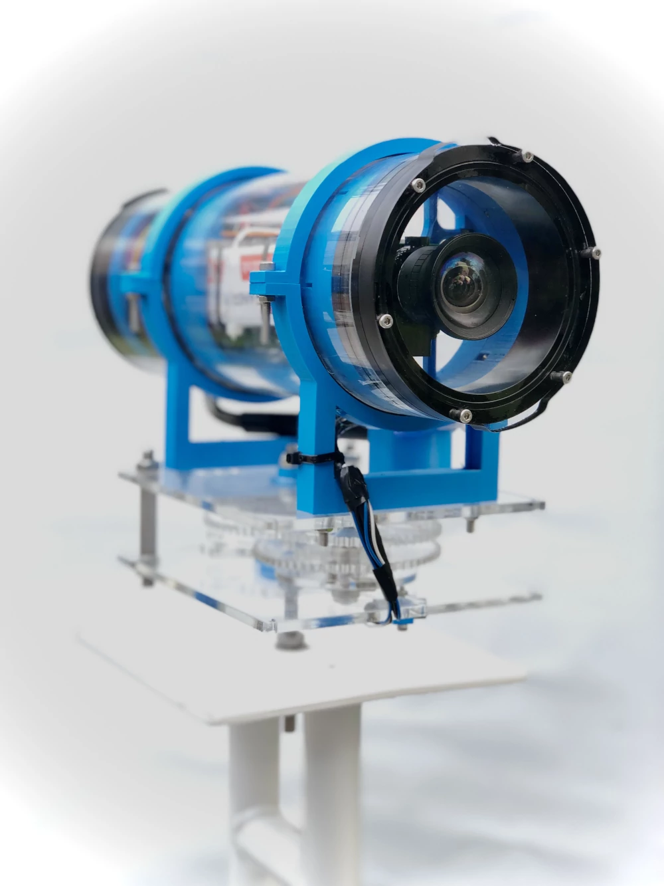

# KOSMOS 3.0

Le KOSMOS est un programme de sciences participatives née du partenariat atypique
entre une institution scientifique, l’Ifremer, et un Tiers Lieu, le Konk Ar Lab, Fablab de
Concarneau. Cette caméra d’observation de la faune et de la flore sous marine côtière a
permis de réunir autour d’un projet commun, acteurs de la recherche scientifique et de la
société civile.

La fabrication du KOSMOS au Konk Ar Lab est un formidable exemple d’intelligence
collective. Bénévoles et scientifiques collaborent main dans la main afin de concevoir cet
outil en s’assurant qu’il soit reproductible par tous, peu coûteux et scientifiquement
viable, c’est à dire répondant au protocole scientifique déjà en vigueur pour l’observation
et le suivi des écosystèmes côtiers.

Ce sont ces trois enjeux qui ont motivé Dominique Pelletier, directrice de recherche
Écologie et Modèles pour l’Halieutique (EMH), à se tourner vers le Konk Ar Lab. En effet,
Dominique a d’ores et déjà développé deux caméras utilisées à travers le monde : le
STAVIRO et le MICADO. Cependant, leur mode de fabrication est limitant et ne permet
pas à tout acteur (institution scientifique, parc naturel marin, citoyen) de s’emparer du
projet alors même que nos besoins d’évaluation et de suivis sont croissant. Le KOSMOS
offre donc une solution non négligeable a ce qui semblait être une impasse.

L’Ifremer s’est tourné vers le FabLab de Concarneau en sa qualité de lieu de facilitation
sociale par le numérique. Le Konk Ar Lab, implanté sur le territoire de Concarneau
Cornouailles Agglomération (CCA), est un lieu réunissant tout type de publics locaux
autour de projets numériques et techniques venus de divers horizons. Ce projet est donc
un moyen innovant de partager ses connaissances tant sur des aspects techniques,
mécaniques que biologiques ou écologiques.

Découvrir, partager, sensibiliser sont les thèmes centraux du projet KOSMOS. Un
programme de sciences participatives visant à réunir plaisanciers et scientifiques autour
de l’utilisation de la caméra en mer, verra le jour en 2023. L’objectif est de permettre à tout
un chacun de collecter des vidéos lors de sorties en mer et de les analyser. En offrant
ainsi de nouvelles données aux scientifiques, les observateurs développent ou

approfondissent leur connaissances du milieu côtier et offrent la possibilité de suivre son
évolution sur le long terme.
