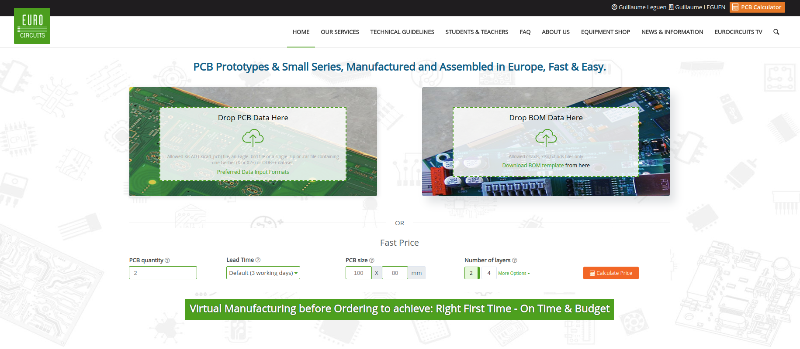
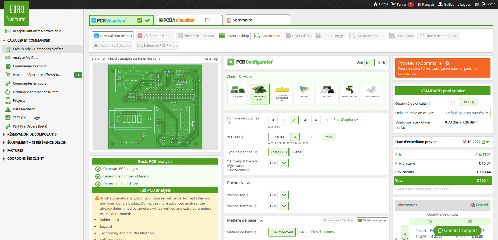

# Annexe : Faire fabriquer un PCB

## 1/ A partir de notre archive (facile) 

 - [Télécharger l'archive des fichiers gerbers et de perçages](https://github.com/gheleguen/KOSMOS_tech/blob/main/hardware/electronics/kosmosV3_pcb.zip)
 - Conserver cette archive sous format .zip
 - [Se rendre sur le site de euro circuit](https://www.eurocircuits.com/)
 - Se créer un compte sur le site d'euro circuit
 - Sur la page d'accueil, cliquer sur "Drop PCB Data Here"

 - Une fenêtre d'exploration s'ouvre, sélectionner l'archive précédemment téléchargé. 
 - Passer les étapes d'assemblage. En effet, nous allons commander un PCB seul sans les composants soudés. 
 - Sélectionner "Basic analyse"
 - Puis entrer le nombre de PCB à commander. il est recommandé d'en commander 10 minimum. En dessous le prix ne sera pas avantageux. 
 - Si tout s'est bien passé, le PCB devrai apparaître. Sous l'aperçus du PCB, vous pouvez lire si l'analyse basique a fonctionné. 
 - Les paramètres qui suivent sont renseignés automatiquement par la lecture des fichiers gerbers. Il est recommandé de ne pas modifier ces paramètres. Il est possible de changer la couleur du PCB dans l'onglet "Définition CI"
 - Sur la droite, on peut lire la coût de fabrication d'une unité ainsi que le coût total du projet. 
 - Cliquer sur le bouton orange (au sommet de la colonne de droite) "proceed to sommaire"
 - Une analyse plus possé va s'effectuer. Ceci prend généralement moins d'un quart d'heure.

 - Si l'analyse est validé, procéder à la commande. 

**note :**
 - [Le site de nextPCB](https://www.nextpcb.com/) propose des fabrications gratuite de prototypes à hauteur de 10 exemplaires maximum par commande.

 
## 2/ Ou à partir des fichiers PCB (Expert)
Cette étape sera utile si vous avez besoin de modifier quelque-chose dans le tracé du PCB pour l'adapter. 

 - Télécharger les fichiers ".kicad_pcb" ".kicad_pro" et ".kicad_sch" présents depuis la racine du dépôt git en suivant le chemin suivant : /hardware/electronics/ 
 - Ouvrir ces fichiers au moyen du [logiciel kicad](https://www.kicad.org/).
 - Effectuer les modifications nécessaires. 
 - Générer les fichiers gerber (fichier ; Tracer), sélectionner les couches utiles. Cocher la vérification des plans de masses et "Utiliser extensions Gerber Protel". Diriger cet export dans un dossier de préférence vide.
 - Cliquer sur "Tracer". Le logiciel va créer plusieurs fichiers. 
 - Ne pas oublier depuis la même fenêtre de générer les fichiers de perçage en cliquant sur le bouton "Créer Fichiers de Perçages..."
 - Enfin compresser en .zip le dossier contenant les fichiers gerbers et le fichier de perçage. 
 - Le dossier ainsi compressé pourra être déposé sur euro cricuit ou next PCB (cf. chapitre précédent)

## Liens connexes 

 - Tutoriel YouTube pour exporter les fichiers gerber : https://youtu.be/I6-BzFYGuvg

