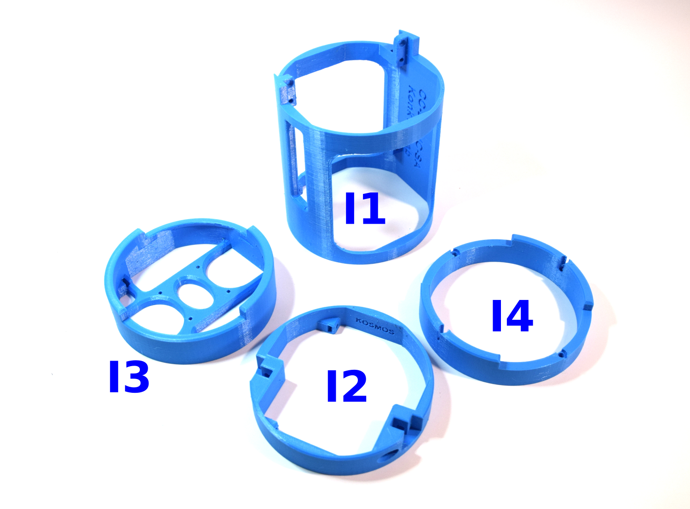
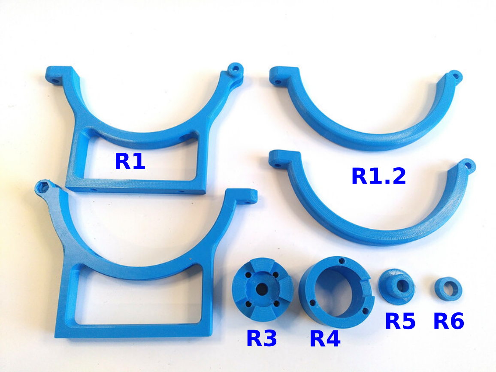
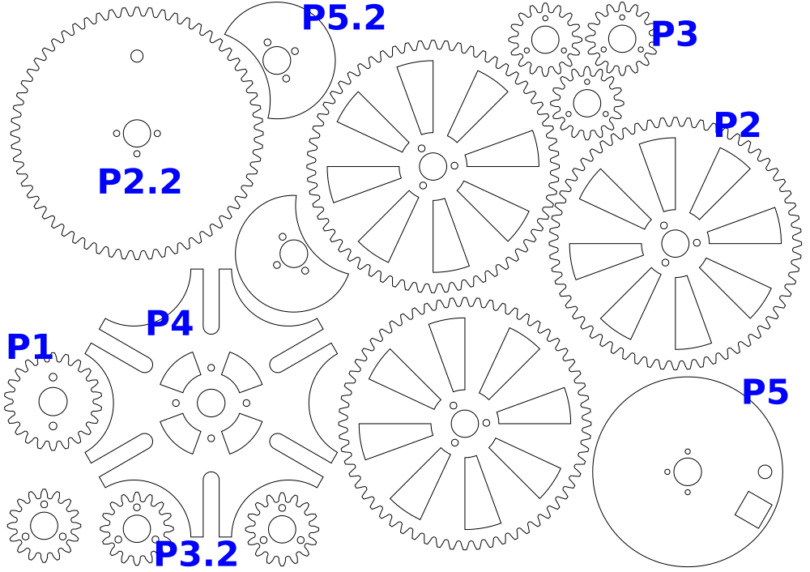

## 1/ Impression des pièces en 3D

Imprimer toutes les pièces nécessaires. [Les fichiers STL sont disponibles ici](https://wikifactory.com/@konkarlab/kosmos30/files/KOSMOS_3-0_beta1/3Dmodels_KOSMOS_3-0) .

​

**1.1 Pour l'intérieur du caisson :**

* 1 x I1 qui va supporter la carte Rapsberry
* 1x I2, qui va faire le lien entre la structure Raspberry et la plaque sur laquelle va se positionner les batteries.
* 1x I3,qui va supporter la PiCam
* 1x I4, qui va se visser à une flange du tube pour empécher les structures internes du KOSMOS de pouvoir tourner dans le tube.

​

​

**1.2 Pour l'extérieur du caisson :**

​

Toutes ces pièces doivent êtres impérativement imprimés en PET. En effet, cette matière est la plus résistante à l'eau de mer parmi les matériaux disponibles en impression 3D FDM. Si vous disposez d'autres technologies, ne pas hésiter à essayer et nous faire part du résultat. Cependant, nous savons que la résine par SLA ne convient pas pour une raison de dureté. Il peut-être intéressant également de travailler à un réducteur sans impression 3D à la fraiseuse uniquement pour rendre la plongée possible à de plus grandes profondeurs.

Nous recommandons un taux de remplissage des pièces qui ne soit inférieur à 30%. Toutes nos pièces ont un taux de remplissage à 100%.

* 1x R3 qui permet de transmettre l'effort de la croix de malte à la tige fileté.
* 1x R5, permets de guider l'arbre secondaire et de ne pas serrer les flasques avec les engrenages de cet arbre.
* 1x R6, une entretoise sur l'arbre primaire
* 1x R4, l'entretoise pour le support moteur
* 1x Reducteur3D n°5 SupMag, permets de placer le capteur magnétique
* 2x R1 et 2x R1.2 , permet de maintenir le caisson solidaire au

​

​

_Note  : Toutes les pièces devront être netoyées de leurs supports et au cours du montage, elles nécéssiteront peut-être d'être limées \(papier de verre ou lime à main\) afin de supprimer toutes traces de fils d'anges._

## 2/ Découpe des pièces planes au laser

Le KOSMOS 2.3 est composé en plus de pièces imprimés en 3D et de visserie Inox de pièces à découper au laser dans des plaques de PMMA et de POM. Ainsi on peut immerger ses pièces dans l'eau sans craindre la pression. Les pièces de l'intérieur du caisson peuvent être aussi imprimés en 3D.  [Les trois fichiers vectoriels évoqués ci-dessous sont disponibles ici. ](https://wikifactory.com/@konkarlab/kosmos30/files/KOSMOS_3-0_beta1/Laser-cuts_KOSMOS_3-0_beta1)

​

**2.1 Pour l'intérieur du caisson :**

* Télécharger le fichier PMMA-5mm\_A5\_laser-cut.svg
* Découper les pièces S1 S2 dans du PMMA de 5mm d'éppaisseur \(prévoir l'équivalent de la surface d'une feuille A5\) ;

​

​

**2.2 Pour l'extérieur du caisson :**

Ces pièces constituent l'enveloppe du réducteur du KOSMOS. On peut les réaliser en PMMA 5mm si on veut voir à travers ou un autre plastique de 5mm comme des plaques de plastique recyclé.

* Il est nécéssaire de sélectionner une plaque de PMMA bien plane de 5mm d'épaisseur \(prévoir l'équivalent de la surface d'une feuille A3\) ;
* Télécharger le fichier PMMA-5mm\_A3\_Laser-cut.svg pour lancer une découpe au laser ou à la fraiseuse numérique ;
* Toutes les pièces sont disposées ici de manière à rentrer dans un format A3 \(42\*29,7 cm\).

​

​

**2.3 Les pièces en mouvements \(engrenages...\) seront usinés de préférence en POM.**

* Il est nécéssaire de sélectionner une plaque  de POM bien plane de 5mm d'épaisseur ;
* Utiliser le fichier POM-5mm\_A4\_laser-cut.svg pour lancer une découpe ;
* Toutes les pièces sont disposées ici de manière à rentrer dans un format A4 \(21\*29,7 cm\) ;

​

​

## 3/ Electroniques et câblages

### 3.1 Fabrication du PCB
 - Sur une plaque de circuit imprimé cuivré graver le PCB.
 - Fabriquer le PCB en suivant la documentation en annexe. [Utiliser le fichier pdf](hardware/electronics/PCB_forprint_KOSMOS_v3-0.pdf) 

### 3.1 Perçage du PCB et soudure

​

* A l'aide d'une dremel sur colonne ou d'une dremel à la main percer les trous du circuit imprimé avec un foret de 0,8mm.
* Élargir les trous dans lesquelles on soudera des pins duponts males \(Encadrés en vert cf. visuels ci dessous\) à l'aide d'un foret de 0,9mm ou 1mm.
* A ces mêmes emplacements, souder des broches duponts mâles.  /!\ Attention on soude les composants de manière a ce qu'ils soient sur la face opposé au circuit. Seule les pattes traversent et sont soudés du coté du circuit.

​

​

​

* Souder 2 résistances de 220ohm et 6 résistances de 1Kohm \(cf. photo ci dessous, 220ohm en bleu et 1kohm en orange\). \(PCB\_step3-2.png\).

​

​

​

* Souder les deux diodes en veillant à respecter la polarité. Sur une diode le plus est matérialisé par la patte la plus longue. \(Une LED rouge et une LED verte cf.photo ci dessous\).

​

​

​

* Souder 4 fils qui servirons de pont \(en vert cf. dessin ci dessous\).

​

​

* Souder sur les broches duponts, dans le sens indiqué les 3 modules RTC \(Horloge\), l'indicateur de niveau de batterie et le relai. 

​

​

​

* Souder 3 ILS sur les emplacements indiqués \(en orange cf. dessin ci dessous\). \(PCB\_step3-6.png\)

​

